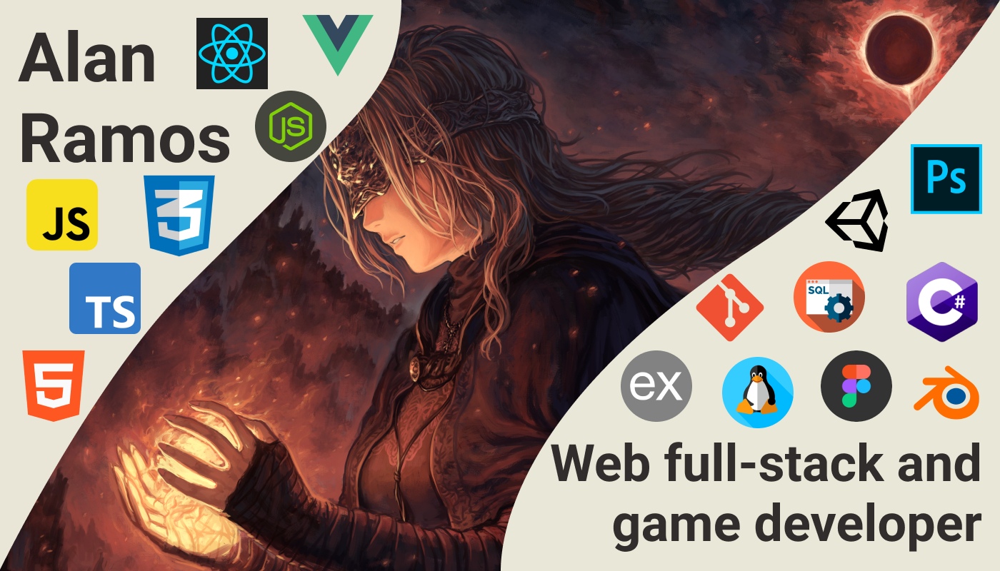

### 👋 Hey! Hello foreigner! 👋

Welcome to deepzS2 github,
I'm a **Full Stack Developer**, **UI/UX designer** and learning about **Game development**.

The language I love to develop is **JavaScript**, but I'm looking forward to learn another languages like **C++**...

I know libraries/frameworks NodeJS like **[ReactJS](https://pt-br.reactjs.org), [VueJS](https://vuejs.org), [TypeScript](https://www.typescriptlang.org), [ExpressJS](https://expressjs.com/pt-br/) and [React Native](https://reactnative.dev)** and learning a lot more about!
I'm also learning about the potential of [ThreeJs](https://threejs.org) which you can use to make 3D websites (even games in the web 👀).

Here are some ideas to get you started:

- 🔭 I’m currently unemployed
- 🌱 I’m currently learning JavaScript, C# for Unity, Pentest, 3D Modeling and Digital Art.
- 💬 Ask me about games, programming, design, etc.
- ⚡ Fun fact: I love Game Development and I want to learn about it...

### Things I learned by studying
And I'll still learning more about the crazy world of programming!

- [x] Python;
- [x] SQL (PostgresSQL and MySQL);
- [x] C# for Unity;
- [ ] C++;
- [x] JavaScript;
- [x] Blender;
- [x] Linux;
- [x] Git;

### Stats

